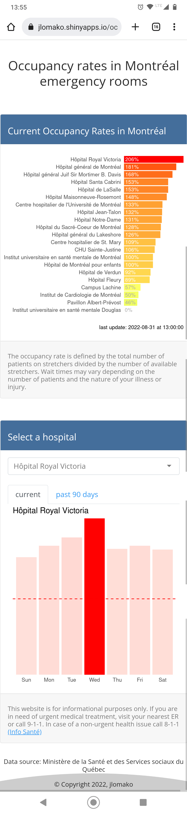

# Occupancy app
Shiny app that tracks occupancy rates in Montréal emergency rooms. 
### <a href = "https://jlomako.shinyapps.io/occupancy_app/">https://jlomako.shinyapps.io/occupancy_app/</a>

(Note: Source from Ministère de la Santé et des Services sociaux du Québec is currently not being updated -- last update was September 14, 2022 4:45 AM. Using backup data that updates once a day instead)
  

### note to myself
* set wd to script directory to deploy app in R
* reactive expression must be within a reactive or render* function <code>selected <- reactive(data %>% select(Date, occupancy = input$hospital))</code>, don't forget parentheses when calling that variable <code>selected()</code>
* shiny currently uses backup data from pdfscraper bot
