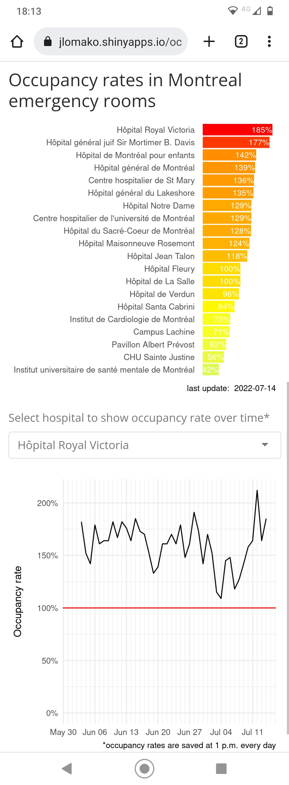

<h1>Occupancy app</h1>
Interactive app (Shiny) to explore occupancy rates in Montreal emergency rooms.
  
Link to app:

<a href = "https://jlomako.shinyapps.io/occupancy_app/">https://jlomako.shinyapps.io/occupancy_app/</a>

 
screenshot (mobile app)

 

### to do:
* remove extra days in plot
