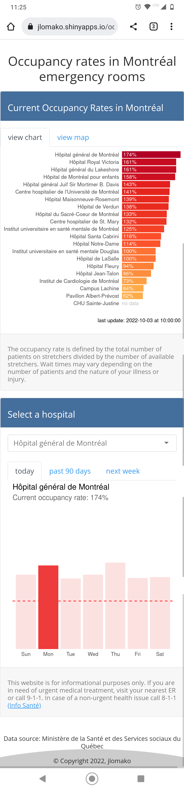

## Track current occupancy rates in Montréal emergency rooms: 
### <a href="https://jlomako.shinyapps.io/occupancy_app/">Launch app</a>

It can be difficult to find medical treatment in Montréal. This shiny app shows you which hospitals are busiest in Montréal. 
The app is updated every hour, and for each hospital, you can see the average occupancy rates over the week, as well as the occupancy over the past 90 days. A new feature predicts the occupancy for the next 7 days for each hospital. The map shows you where the ERs are located.
The app is mobile-friendly and interactive, making it easy for users to find the information they need.
This shiny app is hosted on <a href="https://jlomako.shinyapps.io/occupancy_app/">shinyapps.io</a>.

Il peut être difficile de se soigner à Montréal. Cette application Shiny vous montre quels sont les hôpitaux les plus occupés de Montréal. L'application est mise à jour toutes les heures et, pour chaque hôpital, vous pouvez voir le taux d'occupation moyen sur une semaine, ainsi que l'occupation des 90 derniers jours. Une nouvelle fonctionnalité prédit l'occupation des 7 prochains jours pour chaque hôpital. La carte vous montre où se trouvent les urgences. L'application est adaptée aux mobiles et interactive, ce qui permet aux utilisateurs de trouver facilement les informations dont ils ont besoin. 

## preview:

 
https://jlomako.shinyapps.io/occupancy_app/

### note to myself
* set wd to script directory to deploy app in R
* reactive expression must be within a reactive or render* function <code>selected <- reactive(data %>% select(Date, occupancy = input$hospital))</code>, don't forget parentheses when calling that variable <code>selected()</code>
* long-term data is collected by <a href="https://github.com/jlomako/hospital-occupancy-tracker">hospital-occupancy-tracker</a> and <a href="https://github.com/jlomako/pdfscraper">pdfscraper</a> (backup)
* predictions are done by <a href="https://github.com/jlomako/prophet-bot">prophet-bot</a>

