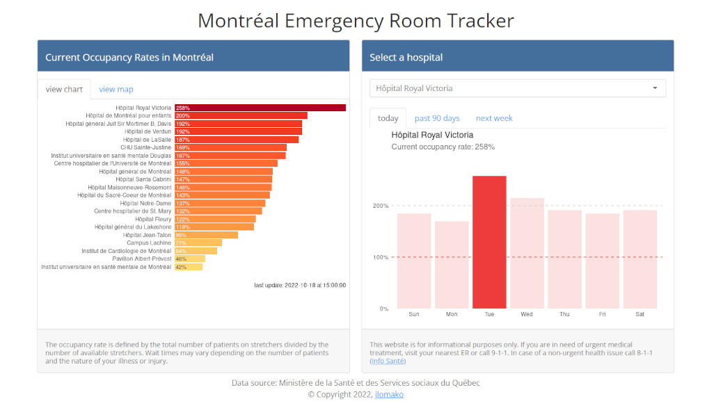

## Montréal Emergency Room Tracker 
### <a href="https://jlomako.shinyapps.io/Montreal_ER/">Open app</a>

This app shows you which emergency rooms are busiest in Montréal. 
The app is updated every hour to show the current occupancy for each ER.
For each hospital, you can track the median occupancy rates over the week, 
as well as the occupancy over the past 90 days. 
It can predict the occupancy for the next week, based on data that was collected over time.
The app has a map, so users can see where the hospitals are located.
The app is mobile-friendly and interactive, making it easy for users to find the information they need.
This app was written in R Shiny and is hosted on <a href="https://jlomako.shinyapps.io/Montreal_ER/">shinyapps.io</a>.

Cette application Shiny vous montre quelles salle d'urgence sont les plus occupées à Montréal. L'application est mise à jour toutes les heures et, pour chaque hôpital, vous pouvez voir le taux d'occupation moyen sur une semaine, ainsi que l'occupation des 90 derniers jours. Une nouvelle fonctionnalité prédit l'occupation des 7 prochains jours pour chaque hôpital. La carte vous montre où se trouvent les urgences. L'application est adaptée aux mobiles et interactive, ce qui permet aux utilisateurs de trouver facilement les informations dont ils ont besoin. 

## preview:

## notes to myself:
* set wd to script directory to deploy app in R
* reactive expression must be within a reactive or render* function <code>selected <- reactive(data %>% select(Date, occupancy = input$hospital))</code>, don't forget parentheses when calling that variable <code>selected()</code>
* long-term data is collected by <a href="https://github.com/jlomako/hospital-occupancy-tracker">hospital-occupancy-tracker</a> and <a href="https://github.com/jlomako/pdfscraper">pdfscraper</a> (backup)
* predictions are done by <a href="https://github.com/jlomako/prophet-bot">prophet-bot</a>
* app was re-named and has moved to new address: https://jlomako.shinyapps.io/Montreal_ER/
* map shows all of Quebec now
* matching problem with color palette in chart and map? -> maps shows only surrounding hospitals now
