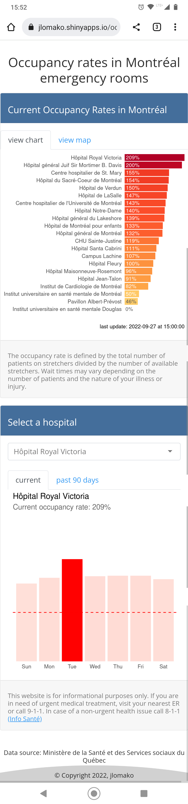

### Track current occupancy rates in Montréal emergency rooms in Shiny app: 
https://jlomako.shinyapps.io/occupancy_app/

  

### note to myself
* set wd to script directory to deploy app in R
* reactive expression must be within a reactive or render* function <code>selected <- reactive(data %>% select(Date, occupancy = input$hospital))</code>, don't forget parentheses when calling that variable <code>selected()</code>
* shiny uses backup data from pdfscraper, since there are no updates since Sep 14 -- note: back to usual on Sep 20
